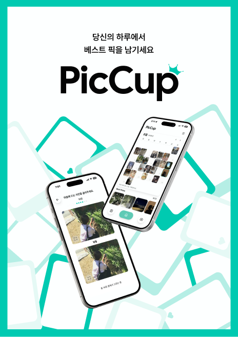
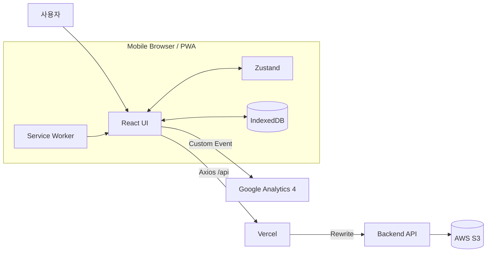
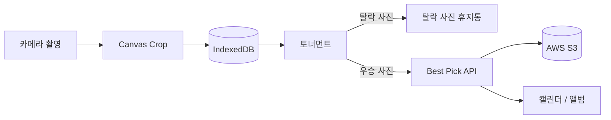

<div align="center">



# PicCup

**여러 장의 사진 중 최고의 한 장을 고르고,  
카테고리와 캘린더에 기록하는 사진 아카이빙 서비스**

촬영한 사진을 토너먼트 방식으로 비교해 Best Pick을 선정하고,  
선택한 사진을 앨범과 캘린더에서 다시 확인할 수 있습니다.

</div>

## 목차

- [Stack](#stack)
- [프로젝트 구조](#프로젝트-구조)
- [시스템 설계](#시스템-설계)
- [실행 단위](#실행-단위)
- [설계 과정에서의 고민](#설계-과정에서의-고민)
- [구현한 핵심 기능](#구현한-핵심-기능)
- [구현 완료 사항](#구현-완료-사항)
- [추후 보완 사항](#추후-보완-사항)
- [로컬 실행](#로컬-실행)
- [구성원](#구성원)

---

## Stack

### Language


### Frontend


### Deploy


### Browser Storage


### Development · Quality


### Analytics

## 

## 프로젝트 구조

현재 프로젝트는 화면, 상태 로직, API 통신, 브라우저 기능을 역할에 따라 분리했습니다.

```text
src
├── api                         # Axios 설정과 서버 API 요청
│   ├── authApi.js              # 회원가입, 로그인, 프로필
│   ├── bestPickApi.js          # 베스트픽, 캘린더, 휴지통
│   ├── categoryApi.js          # 카테고리 CRUD
│   ├── instance.js             # Axios 공통 인스턴스
│   └── request.js              # GET, POST, PUT, PATCH, DELETE
│
├── components                  # 공통 UI 및 도메인 컴포넌트
│   ├── auth                    # 인증 입력창, 버튼, 약관
│   ├── camera                  # 카메라 화면, 권한 안내
│   ├── category                # 정렬 및 뷰 옵션
│   ├── home                    # 캘린더와 Best Pick 목록
│   ├── layout                  # 헤더, 내비게이션, 모달, 스낵바
│   ├── profile                 # 프로필 관련 컴포넌트
│   ├── tournament              # 토너먼트 대진과 우승 화면
│   └── trash                   # 휴지통 탭, 그리드, 액션바
│
├── constants                   # 여러 파일에서 사용하는 고정값
│
├── hooks                       # React 상태와 화면 동작 로직
│   ├── album
│   ├── auth
│   ├── camera
│   ├── category
│   ├── home
│   ├── profile
│   ├── tournament
│   └── trash
│
├── libs                        # 브라우저·외부 기능을 감싼 코드
│   ├── analytics.js            # GA4 이벤트
│   ├── imageActions.js         # 이미지 다운로드·공유
│   └── photoDB.js              # IndexedDB 사진 저장
│
├── mocks                       # MSW 개발용 Mock API
├── pages                       # 라우팅 단위 페이지
├── store                       # Zustand 전역 상태
├── styles                      # 디자인 토큰과 전역 CSS
├── utils                       # 날짜, 검증, 이미지 계산 함수
├── App.jsx                     # 라우팅 및 앱 초기화
└── main.jsx                    # React 및 MSW 실행 진입점
```

### 폴더 분리 기준

| 폴더         | 기준                               |
| ------------ | ---------------------------------- |
| `api`        | 서버 API 요청                      |
| `components` | 재사용 가능한 UI                   |
| `hooks`      | React 상태를 가진 화면 로직        |
| `libs`       | IndexedDB, 분석, 브라우저 기능     |
| `store`      | 여러 페이지에서 공유하는 전역 상태 |
| `utils`      | React에 의존하지 않는 순수 계산    |
| `constants`  | 여러 파일에서 공유하는 고정값      |

---

## 시스템 설계



### 사진 데이터 흐름



촬영한 모든 사진을 서버에 전송하지 않고, 후보 사진은 IndexedDB에서 관리합니다.  
토너먼트에서 선정된 최종 우승 사진만 서버와 S3에 업로드합니다.

---

## 실행 단위

| 실행 단위         | 역할                                      |
| ----------------- | ----------------------------------------- |
| React Application | 페이지 렌더링, 사용자 입력 및 상태 처리   |
| Service Worker    | PWA 설치 및 정적 자산 캐싱                |
| IndexedDB         | 촬영 후보 및 탈락 사진 Blob 저장          |
| Axios Client      | 세션 쿠키를 포함한 백엔드 API 요청        |
| Backend API       | 인증, 카테고리, 베스트픽, 휴지통 처리     |
| AWS S3            | 베스트픽 및 프로필 이미지 저장            |
| MSW               | 백엔드가 없는 개발 환경에서 Mock API 제공 |
| GA4               | 주요 사용자 행동 이벤트 분석              |

---

## 설계 과정에서의 고민

### 1. 모든 촬영 사진을 서버에 업로드하지 않은 이유

초기에는 촬영한 모든 사진을 서버에 올리는 구조를 고려했습니다.  
하지만 토너먼트에서 탈락할 사진까지 서버에 저장하면 다음 문제가 발생합니다.

- 불필요한 네트워크 요청 증가
- 서버 및 S3 저장 공간 낭비
- 모바일 환경에서 업로드 대기 시간 증가
- 촬영 도중 네트워크 상태에 따라 사용자 흐름이 중단될 가능성

이를 해결하기 위해 촬영 사진을 Blob으로 변환해 IndexedDB에 저장했습니다.

```text
카메라 촬영
→ Canvas로 비율에 맞게 Crop
→ JPEG Blob 생성
→ IndexedDB 저장
→ 토너먼트 진행
→ 우승 사진만 서버 업로드
```

IndexedDB는 Blob을 저장할 수 있어 문자열 중심인 `localStorage`보다 사진 임시 저장에 적합합니다.

---

### 2. 촬영 세션과 토너먼트 상태 관리

각 촬영 흐름에는 `crypto.randomUUID()`로 고유한 `sessionId`를 부여합니다.

같은 `sessionId`를 가진 사진만 하나의 토너먼트 후보로 불러오며, 사진을 두 장씩 비교해 선택된 사진을 다음 라운드로 전달합니다. 사진 수가 홀수라면 마지막 사진은 자동으로 다음 라운드에 진출합니다.

최종 우승 사진이 결정되면 다음 정보를 `multipart/form-data`로 서버에 전송합니다.

| 필드             | 설명                  |
| ---------------- | --------------------- |
| `file`           | 우승 사진 Blob        |
| `categoryId`     | 촬영한 카테고리 ID    |
| `capturedDate`   | 촬영 날짜             |
| `candidateCount` | 토너먼트 후보 사진 수 |

React 개발 환경의 중복 실행으로 같은 사진이 여러 번 업로드되지 않도록, 업로드한 사진 ID를 `ref`에 기록해 중복 요청을 방지했습니다.

---

### 3. 카메라 권한 거부 이후 재시도

기존에는 사용자가 카메라 권한을 거부하면 페이지를 다시 나갔다 들어와야만 카메라 요청을 다시 시도할 수 있었습니다.

이를 개선하기 위해 `getUserMedia()`에서 발생하는 오류를 구분해 별도의 권한 안내 화면을 제공했습니다.

| 오류               | 처리                                |
| ------------------ | ----------------------------------- |
| `NotAllowedError`  | 권한 설정 안내                      |
| `NotFoundError`    | 사용 가능한 카메라가 없음을 안내    |
| `NotReadableError` | 다른 앱이 카메라를 사용 중임을 안내 |
| `SecurityError`    | 보안 환경 문제 안내                 |
| 기타 오류          | 다시 시도 안내                      |

사용자는 같은 화면에서 `다시 시도` 버튼을 눌러 카메라 요청을 다시 실행할 수 있습니다. 연속 클릭으로 요청이 중복되지 않도록 요청 중 상태도 별도로 관리합니다.

브라우저가 권한을 영구 차단한 경우 JavaScript로 권한 창을 강제로 띄울 수 없으므로, 브라우저 또는 기기 설정에서 권한을 변경하도록 안내합니다.

---

### 4. 세션 기반 인증 상태 유지

로그인 성공 시 서버가 `JSESSIONID` 세션 쿠키를 발급합니다.

Axios 인스턴스에 다음 설정을 적용해 이후 API 요청에도 세션 쿠키를 자동으로 포함합니다.

```js
const instance = axios.create({
  baseURL: "/api",
  withCredentials: true,
  timeout: 60000,
});
```

앱 실행 및 새로고침 시 `GET /api/users/me`를 호출해 세션 유효성을 확인합니다.

```text
앱 실행
→ /api/users/me 요청
→ 성공: 사용자 정보를 Zustand에 저장
→ 401: 비로그인 상태로 변경
→ 인증이 필요한 페이지는 ProtectedRoute로 차단
```

세션 확인 중에는 인증 화면이 순간적으로 노출되지 않도록 스플래시 화면을 표시합니다.

---

### 5. 클라이언트와 서버 휴지통 분리

PicCup은 사진의 저장 위치에 따라 휴지통을 두 종류로 분리했습니다.

| 구분               | 저장 위치 | 보관 기간 | 복구 방식                   |
| ------------------ | --------- | --------: | --------------------------- |
| 토너먼트 탈락 사진 | IndexedDB |       7일 | Best Pick 업로드 API 재사용 |
| 삭제한 Best Pick   | 서버 · S3 |      30일 | 서버 복구 API 호출          |

탈락 사진은 앱 실행 시 만료 시간을 검사해 7일이 지난 사진을 IndexedDB에서 제거합니다.

삭제한 Best Pick은 서버에서 Soft Delete로 처리하며, 복구 또는 영구 삭제 API를 통해 관리합니다.

여러 탈락 사진을 한 번에 복구할 때는 `Promise.allSettled()`를 사용해 한 장이 실패하더라도 나머지 업로드를 계속 진행합니다.

---

### 6. S3 이미지 다운로드와 공유

S3 이미지 URL을 바로 다운로드하거나 공유하려 했을 때, S3 응답에 CORS 헤더가 없어 브라우저의 `fetch` 요청이 차단됐습니다.

S3에서 프론트엔드 도메인과 `GET`, `HEAD` 요청을 허용한 뒤 이미지 응답을 Blob으로 변환했습니다.

```text
S3 imageUrl
→ fetch
→ Blob
→ File 또는 Object URL
→ 공유 / 다운로드
```

- 공유: Web Share API
- 다운로드: Object URL과 임시 `<a>` 태그
- 파일 공유 미지원 환경: 링크 공유 또는 클립보드 복사

이를 통해 별도의 이미지 다운로드 API 없이 S3의 `imageUrl`만으로 모바일 다운로드와 공유를 구현했습니다.

<!--
CORS 오류와 해결 화면 이미지 권장 위치
1. CORS 콘솔 오류
2. S3 설정 및 Blob 변환 코드
3. 모바일 다운로드·공유 결과
-->

---

### 7. 백엔드 없이도 개발할 수 있는 환경

백엔드 서버의 무료 배포 환경이 중단되거나 응답이 불안정하면 프론트엔드 개발도 함께 중단되는 문제가 있었습니다.

MSW를 도입해 개발 환경에서 실제 API와 같은 URL을 가로채 Mock 응답을 반환하도록 구성했습니다.

```js
if (import.meta.env.DEV && import.meta.env.VITE_USE_MOCK_API === "true") {
  // MSW 실행
}
```

Mock 모드는 개발 환경에서만 활성화되며, 비활성화하면 기존 프론트 코드 변경 없이 실제 서버 API에 연결됩니다.

---

### 8. PWA 캐시 범위 결정

모바일에서 앱과 유사한 경험을 제공하기 위해 PWA를 적용했습니다.

- 홈 화면 설치
- 주소창 없는 Standalone 실행
- 앱 아이콘 및 테마 색상
- 정적 자산 캐싱

다만 사용자별 API 응답과 S3 사진까지 캐싱하면 오래된 데이터나 다른 사용자의 사진이 남을 수 있어, 앱 실행에 필요한 정적 파일만 캐싱했습니다.

```js
workbox: {
  globPatterns: [
    '**/*.{js,css,html,ico,png,svg,webp}',
  ],
  cleanupOutdatedCaches: true,
}
```

업데이트 과정에서 촬영이나 입력 화면이 강제로 새로고침되지 않도록 `registerType: 'prompt'`를 사용했습니다.

---

## 구현한 핵심 기능

### 인증과 사용자

- 이메일·비밀번호 회원가입
- 서비스 이용약관 동의
- 로그인 및 로그아웃
- 세션 기반 로그인 유지
- 비밀번호 재설정
- 인증 페이지 접근 제어
- 닉네임 및 프로필 사진 수정
- Best Pick 또는 기기 이미지로 프로필 사진 설정

### 카테고리

- 카테고리 생성, 조회, 수정, 삭제
- 카테고리 검색
- 가나다순, 최신순 등 정렬
- 카테고리 생성 직후 촬영 시작
- 선택한 촬영 카테고리 전역 상태 관리

### 카메라

- 브라우저 카메라 접근
- 전·후면 카메라 변경
- `1:1`, `9:16`, `3:4` 촬영 비율
- Canvas 기반 이미지 Crop
- 촬영 사진 Blob 변환
- 권한 오류 유형별 안내 및 재시도
- 카메라 스트림 정리

### 토너먼트

- 촬영 세션별 사진 조회
- 두 장씩 비교하는 토너먼트
- 홀수 사진 자동 진출
- 전체 사진 미리보기
- 최종 Best Pick 자동 업로드
- 탈락 사진 IndexedDB 휴지통 이동

### 홈 캘린더

- 월별 Best Pick 조회
- 이전·다음 달 이동
- 날짜별 최신 사진을 캘린더 썸네일로 표시
- 선택한 날짜의 모든 Best Pick 조회
- 월별 기록 일수 계산
- 개별 사진 상세 화면 이동

### 앨범

- 전체 및 카테고리별 사진 조회
- 카테고리 검색 및 정렬
- 사진 보기 크기 변경
- 좋아요 사진 필터
- 사진 다중 선택
- 다른 앨범으로 이동
- 다중 삭제 및 공유
- 개별 사진 좌우 탐색
- 사진 정보 확인

### 이미지 불러오기

- 기기 이미지 다중 선택
- 업로드할 카테고리 선택
- 촬영 날짜 지정
- 선택한 사진을 Best Pick으로 업로드
- 업로드 결과를 앨범과 캘린더에 반영

### 휴지통

- 탈락 사진과 삭제한 Best Pick 탭 분리
- 남은 보관 기간 표시
- 다중 선택
- 사진 복구
- 영구 삭제
- 개별 사진 확인
- 기존 탭 상태 유지
- 작업 완료 스낵바 제공

### PWA 및 분석

- 홈 화면 설치
- Standalone 실행
- 정적 자산 캐싱
- SPA 새로고침 경로 처리
- GA4 페이지 조회
- 카메라 시작, Best Pick 저장, 공유 등 주요 이벤트 수집

---

## 구현 완료 사항

- 촬영부터 토너먼트, Best Pick 저장까지 핵심 사용자 흐름을 완성했습니다.
- 촬영 후보는 IndexedDB, 우승 사진은 서버와 S3에 저장하도록 저장 책임을 분리했습니다.
- 탈락 사진과 삭제한 Best Pick의 휴지통 정책을 저장 위치에 맞게 분리했습니다.
- 공통 디자인 토큰과 컴포넌트를 구성해 화면 간 일관성과 유지보수성을 높였습니다.
- 카메라 권한 거부 이후에도 같은 화면에서 다시 시도할 수 있도록 사용자 흐름을 개선했습니다.
- S3 CORS 문제를 해결하고 별도 다운로드 API 없이 이미지 다운로드와 공유를 구현했습니다.
- MSW를 도입해 백엔드 서버 상태와 관계없이 화면 및 API 흐름을 개발할 수 있도록 했습니다.
- PWA를 적용해 앱스토어 배포 없이 모바일에서 앱과 유사하게 사용할 수 있도록 했습니다.
- GitHub Actions에서 Lint와 Production Build를 검증하고, 조직 저장소의 변경 사항을 개인 Fork에 자동 동기화했습니다.

---

## 추후 보완 사항

### 모바일 브라우저의 제약

PWA Manifest에 세로 방향을 지정했지만, 모든 모바일 브라우저에서 화면 회전을 강제로 차단할 수는 없었습니다.

또한 iOS에서 키보드가 나타날 때 Visual Viewport 크기가 변경되면서 바텀시트와 배경 위치가 함께 움직이는 문제가 있었습니다. 웹 환경만으로 네이티브 앱과 동일한 키보드 동작을 구현하는 데 한계가 있었습니다.

### 카메라 권한의 한계

권한 거부 이후 재시도 UI는 구현했지만, 브라우저에서 영구 차단한 권한을 JavaScript로 직접 변경할 수는 없습니다.

현재는 설정 변경 방법을 안내하고, 사용자가 설정을 변경한 후 다시 시도할 수 있도록 처리했습니다.

### HEIC·HEIF 이미지 처리

일반적인 JPEG 및 PNG 업로드는 가능하지만, iOS에서 생성한 일부 HEIC·HEIF 파일은 브라우저의 MIME Type과 서버 처리 방식에 따라 업로드 결과가 달라질 수 있습니다.

추후 클라이언트 변환 또는 서버 이미지 변환 파이프라인 도입을 검토할 예정입니다.

### 네트워크 및 서버 가용성

백엔드 무료 배포 환경의 Sleep, 메모리 부족, 일시적인 502·503 응답으로 프론트엔드 개발이 중단되는 문제가 있었습니다.

개발 환경에서는 MSW로 대응했지만, 실제 운영 환경에서는 다음 작업이 필요합니다.

- 서버 모니터링
- 사용자 친화적인 재시도 UI
- 네트워크 오류별 안내
- API 재시도 및 타임아웃 정책 보강

### 자동화 테스트 부족

현재 ESLint와 Production Build 검증, 주요 모바일 시나리오 수동 테스트를 수행하고 있습니다. 하지만 컴포넌트 및 사용자 흐름에 대한 자동화 테스트는 충분하지 않습니다.

추후 다음 테스트를 추가할 예정입니다.

- Vitest 기반 유틸 및 Hook 단위 테스트
- React Testing Library 기반 컴포넌트 테스트
- Playwright 기반 촬영 외 주요 사용자 흐름 E2E 테스트
- 다양한 모바일 브라우저 실기기 테스트

---

## CI/CD

GitHub Actions는 조직 저장소의 `main` 브랜치를 기준으로 동작합니다.

```text
Pull Request 또는 main Push
→ npm ci
→ ESLint 검사
→ Production Build
→ 개인 Fork main 브랜치 동기화
→ Vercel 자동 배포
```

동일한 브랜치에서 새로운 작업이 실행되면 이전 실행을 취소해 중복 빌드를 줄였습니다.

---

## 로컬 실행

### 요구사항

- Node.js 20 이상
- npm
- 카메라 테스트 시 HTTPS 또는 `localhost` 환경 권장

### 실제 백엔드 API 사용

`.env.local` 파일을 생성합니다.

```env
VITE_USE_MOCK_API=false
```

개발 서버를 실행합니다.

```bash
npm run dev
```

Vite 개발 서버의 `/api` 요청은 백엔드 서버로 Proxy 됩니다.

### Mock API 사용

백엔드 서버 없이 개발하려면 다음과 같이 설정합니다.

```env
VITE_USE_MOCK_API=true
```

이후 개발 서버를 다시 실행합니다.

```bash
npm run dev
```

MSW가 `/api` 요청을 가로채 Mock 응답을 반환합니다.

### 주요 수동 테스트 시나리오

- 회원가입 → 로그인 → 세션 유지
- 카테고리 생성 → 카메라 진입
- 카메라 권한 거부 → 설정 변경 → 다시 시도
- 여러 장 촬영 → 토너먼트 → Best Pick 업로드
- 홈 캘린더 및 앨범 반영 확인
- 사진 다운로드 및 Web Share API 공유
- 다중 선택 → 이동 및 삭제
- 탈락 사진 복구 및 영구 삭제
- 삭제한 Best Pick 복구 및 영구 삭제
- PWA 홈 화면 설치 및 Standalone 실행
- 등록되지 않은 주소의 404 화면 확인

---

## 구성원

| 이름     | 역할     | 담당                                             |
| -------- | -------- | ------------------------------------------------ |
| `윤소연` | Frontend | 기획, UI 디자인, 프론트엔드 전체 구현, PWA, 배포 |
| `이용운` | Backend  | 기획, 인증, 사용자, 정책, API                    |
| `정홍준` | Backend  | 기획, 인증, API 명세, Best Pick, S3              |

---

<div align="center">

**여러 장의 순간을 비교하고, 가장 마음에 드는 한 장을 기록하세요.**

</div>
